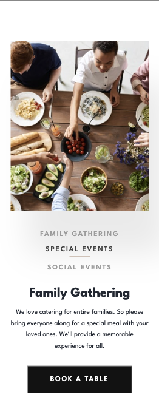

# Frontend Mentor - Dine Website Challenge solution

This is a solution to the [Dine Website Challenge challenge on Frontend Mentor](https://www.frontendmentor.io/challenges/dine-restaurant-website-yAt7Vvxt7). Frontend Mentor challenges help you improve your coding skills by building realistic projects. 

## Table of contents

- [Overview](#overview)
  - [The challenge](#the-challenge)
  - [Screenshot](#screenshot)
  - [Links](#links)
- [My process](#my-process)
  - [Built with](#built-with)
  - [What I learned](#what-i-learned)
  - [Continued development](#continued-development)
  - [Useful resources](#useful-resources)
- [Author](#author)

## Overview

### The challenge

Users should be able to:

- View the optimal layout for each page depending on their device's screen size
- See hover states for all interactive elements throughout the site
- See the correct content for the Family Gatherings, Special Events, and Social Events section when the user clicks each tab
- Receive an error message when the booking form is submitted if:
  - The `Name` or `Email Address` fields are empty should show "This field is required"
  - The `Email Address` is not formatted correctly should show "Please use a valid email address"
  - Any of the `Pick a date` or `Pick a time` fields are empty should show "This field is incomplete"

### Screenshot





### Links

- Solution URL: [Github Repo](https://github.com/mroungou/dine)
- Live Site URL: [Live Site](https://mroungou.github.io/dine/)
## My process

### Built with

- Semantic HTML5 markup
- CSS custom properties
- CSS Grid
- Mobile-first workflow

### What I learned
CSS - before learning about the not() selector I would always manually remove the styles of a particular child element. this definetely simplifies code and makes it more readable.

JS - I am very proud of the fact that I am starting to think of ways to dynamically update the DOM. By storing the data of the images and the text in an array of objects and accessing it based on what the user clicks is an efficient way to do it

```scss
 &:not(:last-child) {
            border-bottom: 1px solid rgba(53, 53, 53, 1);
            }
```
```js
const eventsData = [ // array containg data for the occasion div
    {
        title: 'Family Gathering',
        text: "We love catering for entire families. So please bring everyone along for a special meal with your loved ones. We’ll provide a memorable experience for all.",
        alt: 'Family Gathering',
        mobile: {
            src: './images/homepage/family-gathering-mobile.jpg',
            id: 'family-gathering-mobile',
        },

        tablet: {
            src: './images/homepage/family-gathering-tablet.jpg',
            id: 'family-gathering-tablet',
        },

        desktop: {
            src: './images/homepage/family-gathering-desktop.jpg',
            id: 'family-gathering-desktop',
        }
    },

    {
        title: 'Special Events',
        text: "Whether it’s a romantic dinner or special date you’re celebrating with others we’ll look after you. We’ll be sure to mark your special date with an unforgettable meal.",
        alt: 'Special Events',
        mobile: {
            src: './images/homepage/special-events-mobile.jpg',
            id: 'special-event-mobile',
        },

        tablet: {
            src: './images/homepage/special-events-tablet.jpg',
            id: 'special-event-tablet',
        },

        desktop: {
            src: './images/homepage/special-events-desktop.jpg',
            id: 'special-event-desktop',
        }
    },

    {
        title: 'Social Events',
        text: "Are you looking to have a larger social event? No problem! We’re more than happy to cater for big parties. We’ll work with you to make your event a hit with everyone.",
        alt: 'Social Gathering',
        mobile: {
            src: './images/homepage/social-events-mobile.jpg',
            id: 'social-event-mobile',

        },

        tablet: {
            src: './images/homepage/social-events-tablet.jpg',
            id: 'social-event-tablet',

        },

        desktop: {
            src: './images/homepage/social-events-desktop.jpg',
            id: 'social-event-desktop',
        }
    }
]

const updateOccasionDiv = (index = 0) => { // index will be used to access the dets of eventsData
    // clearing the DOM each time the function is called 
   occasionDiv.innerText = '';
   eventsImgDiv.innerHTML = ''
//    creating img, h6 and p tags since we are clearing the DOM
    const cardImg = document.createElement('img');
    const header6 = document.createElement('h6');
    const eventP = document.createElement('p');

    // this checks the width of the screen - will display the appropriate img
    const screenWidth = window.innerWidth;
    if (screenWidth >= 1440) { // For desktop screens
        cardImg.src = eventsData[index].desktop.src;
        cardImg.alt = eventsData[index].alt;
    } else if (screenWidth >= 768) { // For tablet screens
        cardImg.src = eventsData[index].tablet.src;
        cardImg.alt = eventsData[index].alt;
    } else { // For mobile screens
        cardImg.src = eventsData[index].mobile.src;
        cardImg.alt = eventsData[index].alt;
    }

    // adding the imgs and text to appropriate divs
    eventsImgDiv.append(cardImg);
    header6.innerText = eventsData[index].title;
    eventP.innerText = eventsData[index].text;
    occasionDiv.append(header6, eventP);
}
```
### Continued development

I would definetely like to come back to this one day and build a full stack application

### Useful resources

- [Using Array.prototype.some()](https://developer.mozilla.org/en-US/docs/Web/JavaScript/Reference/Global_Objects/Array/some) - This helped me in implementing clear and concise code
- [Using the date constructor](https://developer.mozilla.org/en-US/docs/Web/JavaScript/Reference/Global_Objects/Date) - This helped me with how the date constructor works and how it can be used for validation

## Author
- Twitter - [@mroungou](https://x.com/mroungou)
